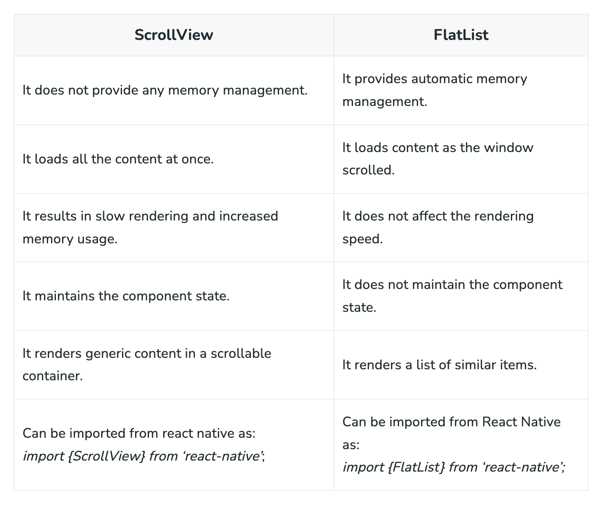

## 🦊 Agenda 

- [React Native](https://reactnative.dev/)
- [RN Framework - Expo](https://docs.expo.dev/)
- Demo
  - [Create Project with Expo](https://docs.expo.dev/get-started/installation/)
  - [RN Project - Struktur Folder](#rn-project---struktur-folder)
  ```
  root-folder-project
     |_ .git <-- pastikan .gitnya memiliki origin ke github bukan ke local
     |_ .gitignore
     |_ .expo <-- berisi file khusus untuk expo, tidak perlu diutak-atik
     |_ app.json <-- berisi konfigurasi yang bisa dikustom (splash image, etc)
     |_ package.json
     |_ package-lock.json
     |_  babel.config.js <-- Menggunakan babel bukan vite 
     |_ assets <-- berisi assets yang dibutuhkan dalam project (gambar, etc)
     |_ App.js <-- File utama yang diberikan (diubah ke jsx lebih baik)
  ```
  - [RN Component](https://reactnative.dev/docs/components-and-apis#basic-components)
    - `<View>` 
    - `<Text>` 
    - `<Image>`
    - `<Button>`
    - `<TextInput>`
    - `<SafeArea>` 
    - `<ScrollView>`
    - `<FlatList>`
  - [RN Styling - Flex](https://reactnative.dev/docs/style)
  - RN Component - ScrollView vs FlatList
    - [Source GeeksForGeeks](https://www.geeksforgeeks.org/when-we-use-scrollview-over-flatlist-or-vice-versa/)
    - [Source Medium](https://justtigist.medium.com/react-native-nugget-scrollview-vs-flatlist-1d565785ad1f)
    

### Asset 

Background :  'https://e0.pxfuel.com/wallpapers/790/952/desktop-wallpaper-mountains-nature-landscape-digital-art-minimal.jpg'

Bongo Cat : "https://custom-doodle.com/wp-content/uploads/doodle/bongo-cat-pixel/bongo-cat-pixel-doodle.gif"

